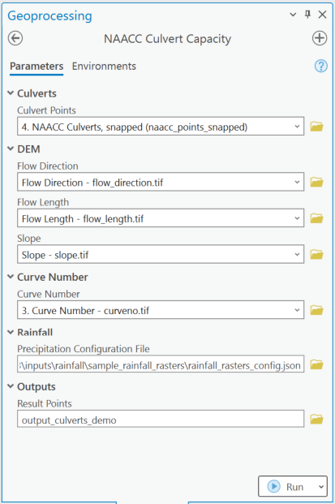
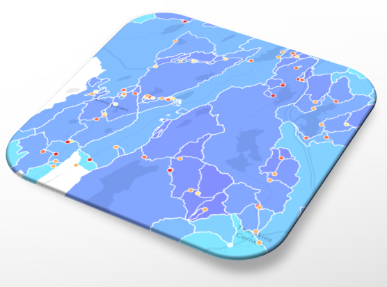

# The Capacity Calculator Workflow

The NAACC Culvert Capacity tool measure the capacity of culverts to handle storm events using a lightweight version of a TR-55 model created by the Cornell Soil & Water Lab. It does this by:

* calculating the capacity of the culvert(s) at a crossing
* calculating peak flow at the culvert over a hydrologically corrected digital elevation model for 24 hour storm events with frequencies of 1 to 1000 years
* comparing capacity of individual culverts and all culverts at a crossing to each peak-flow, and flagging the event at which the culverts and crossings exceed capacity.

## Data Preparation

1. Get and pre-process the NAACC table: [Working with NAACC Culvert Data](data-naacc-table.md)
1. Create (or get) Digital Elevation Model-derived rasters: flow direction, slope, and (optionally) flow length: [Digital Elevation Model-derived Data](data-dem.md)
1. Create (or get) a Curve Number raster: [Generating a Curve Number Raster](data-curve-number-raster.md)
1. Download rainfall data from NOAA: [Getting NOAA Rainfall Data](data-noaa-rainfall.md)

Data Preparation processes are covered on the [Data Overview](data-overview.md) page in more detail.

## Tool Usage (ArcToolbox)

The ArcToolbox implementation of the **NAACC Capacity Calculator** uses the inputs described above.

Note that the Rainfall input isn't the rainfall rasters, but the configuration `JSON` file generated by the **NOAA Rainfall Download** tool.

The only **output** parameter is the location of the output point feature class that will include the analysis results. Note that from the name specified, the name for an additional polygon feature class is derived. More on outputs below.

## Results

Two feature classes are produced by the calculator:

### Analyzed culverts 

This is an outpoint point feature class, containing culvert records with capacity and peak flow analysis results.

This does not include all of the fields from the original NAACC table. Only those added during the NAACC table ingest process (see [Working with NAACC Culvert Data](data-naacc-table.md#what-is-changed-in-the-data-by-this-tool)) and additional fields for the peak flow analysis are shown.

For the peak flow analysis, four new fields will be added for every storm event frequency modeled: 1, 2, 5, 10, 25, 50, 100, 200, 500, and 1000-year storms. The four new fields are:

1. `yX_culvert_peakflow_m3s`: peak flow at the culvert for that event
1. `yX_culvert_overflow_m3s`: the culvert "overflow" for that event: how much the culvert is under or over capacity given peak flow. A negative number indicates that the culvert is under-capacity.
1. `yX_crossing_peakflow_m3s`: crossing peak flow for that event
1. `yX_crossing_overflow_m3s`: the crossing "overflow" for that event: how much all the culverts at the crossing are under or over capacity given peak flow to their common location. A negative number indicates that the crossing is under-capacity.

`X` stands in for the storm event frequency number. All values are in cubic meters/second.

### Delineated catchment areas

An output polygon feature class, containing delineation areas for each culvert, with all values derived from the input layers used for the peak flow analysis. This includes:

* area (square kilometers)
* average rainfall (1000ths/inch) for each storm event frequency
* average slope (%)
* flow length (meters)