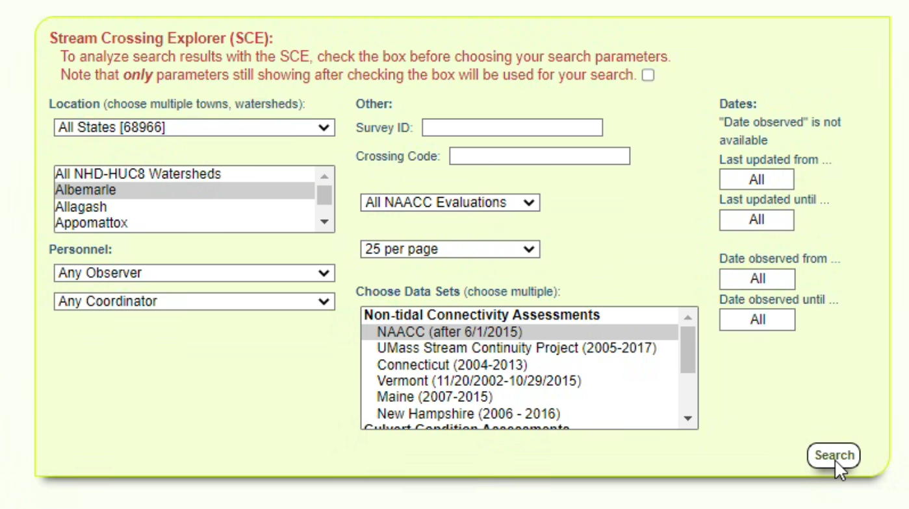
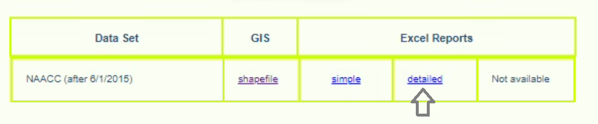

# Working with NAACC Culvert Data

NAACC provides a data standard for capturing culvert data. Much of this toolkit relies on input data having been provided according to that standard.

Follows is a process for getting

## Initial Download and Clean-Up

Raw data from NAACC comes in the form of an Excel spreadsheet file (`xls`). The sheet includes headers. For it to be readable by the toolkit, we need it to be purely tabular.

### 1. Download the Excel (`xls`) file from [NAACC's website](https://naacc.org/naacc_search_crossing.cfm)

Select your area of interest:

Download the "detailed" type:

This will give you an `xls` file, which you can open in Excel or other spreadsheet software.

**Do not download** the shapefile available from NAACC. It does not have all the fields required for modeling and is limited to crossing locations only.

#### Identification

* `Survey_Id` is the ID of the crossing
* `Naacc_Culvert_Id` is the ID of the culvert

Both of these values together are used through the remainder of the tools to differentiate and aggregrate records where necessary. To make compatible with some other GIS tools (specifically, raster process tools), we store IDs as integers (not text).

### 2. Clean-Up

Minmially, delete the file header (the first four rows) from the XLS file. The table needs to be in purely tabular format in order to be read and validated by other tools.

 *Remove rows 1-4 containing the notice about crossing record structure. The column names should end up in row 1.*

#### Optionally: Pre-process the NAACC records

You may want to pair back the download to records of interest or otherwise do some QA/QC on the raw NAACC data; for example:

* remove certain types of culvert, e.g., bridges, fords, or ones that don't have any capacity measurements.
* remove multiple older surveys for crossing locations, or pick the survey with the most complete information
* import this table into GIS and georeference it yourself, in order to move features to streams or flow lines on a digital elevation model

Regardless, as long as the original NAACC schema is preserved through your process, subsequent tools will be able to use it.

The [*NAACC Table Ingest* (described below)](#run-the-naacc-table-ingest-tool) will automatically flag records that aren't valid for capacity calculations, including those that aren't culverts or multi-culverts, or are missing measurements and classifications required for calculating capacity.

### 3. Save as a CSV file

Subsequent tools work on CSV files or feature classes in 

## Run the *NAACC Table Ingest* tool

The *NAACC Table Ingest* tool will read in, validate, and extend a NAACC-compliant source table, and save the output as geodata, i.e., an Esri file geodatabase feature class.

Use your prepared CSV as an input. Note that if you've imported that `CSV` to a file geodatabase table or feature class already, that feature class will also work as an input.

This tool will: 

* validate the records (e.g., check if the measurements for dimensional fields are positive numbers)
* flag those that aren't valid inputs to the tool (either they aren't the right kind of infrastructure or they have invalid field values)
* add new toolkit-specific fields and extract-transform-load individual values to those fields, typically doing either a unit conversion (imperial to metric) or a text-based crosswalk (for certain descriptive fields like crossing, inlet, and outlet types)

### What is changed in the data by this tool:

New fields related to data validation: 

  * `include` 
  * `validation_errors`

New fields for storing transformed copies of capacity model-specific attributes (e.g. values with unit conversion applied).

  * *NAACC field: new field*
  * `Crossing_Type`: `xing_type`
  * `Crossing_Comment`: `comments`
  * `Crossing_Structure_Length`: `length`
  * `Road_Fill_Height`: `hw`
  * `Inlet_Type`: `in_type`
  * `Inlet_Structure_Type`: `in_shape`
  * `Inlet_Width`: `in_a`
  * `Inlet_Height`: `in_b`
  * `Material`: `culv_mat`
  * `Slope_Percent`: `slope`
  * `Outlet_Structure_Type`: `out_shape`
  * `Outlet_Width`: `out_a`
  * `Outlet_Height`: `out_b`

New fields for storing calculator results:

  * `culvert_capacity`: the capacity of the culvert
  * `crossing_capacity`: the total capacity of the crossing (of which this culvert record may be one of many culverts). If just one culvert in the crossing, this is the same as `culvert_capacity`, otherwise it is the sum of `culvert_capacity` for all culverts in the crossing
  * `max_return_period`: the max return period for the crossing

## Optionally: Run the *NAACC Data Snapping* tool

Depending on your needs, you may find that the location precision of the supplied NAACC data was not adequate compared to the accuracy of your [hydrologically corrected DEM](data-dem.md). In that case, you may have moved culverts manually or snapped points to streams.

If you need to update your NAACC table with better location data from an external table--a *Adjusted Geometry File*--use the *NAACC Data Snapping tool* to update the input NAACC-compliant source table with locations from another table.

This tool basically runs a reverse 1-to-many join, replacing geometry in one or more feature class records with a single geometry from feature in a reference table using a column-based match.

This tool generates a new feature class. An additional field `moved` is added indicating whether the culvert has been moved based on a match with the *Adjusted Geometry File*.

### What is changed in the data by this tool:

* updated geometry
* new field: `moved`: a boolean field indicating if the record has been re-snapped based on the supplied reference geometry.