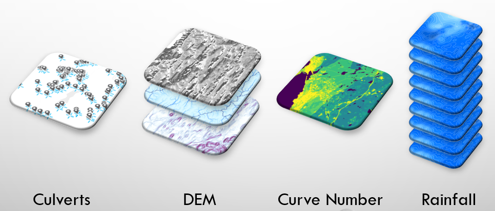

# Overview

The calculators provided by the Culvert Toolkit rely on specific spatial datasets to derive location-specific parameters that are then used as inputs to stormwater runoff and culvert capacity models.

---
## Types of Input Datasets

The section describes what, where, and how to acquire the various inputs required to run the tool. 

Note that a number of these inputs require some basic competency in GIS to create, as they are not necessarily available off-the-shelf (depending on your area of interest).

### *NAACC culvert/crossing records*

The culvert/crossing records available from NAACC provide the starting point for the analysis.

See *[Working with NAACC Culvert Data](data-naacc-table.md)* for more information.

### *Digital Elevation Model (DEM)*

The DEM provides the data for determining what is upstream of a culvert/crossing, as well as some characteristics of that area that are important to calculating peak flow.

Sources for a DEM could be:

* Elevation raster
* Elevation TIN
* Elevation point clouds (i.e., from LiDAR)

From any of those sources, the analytical tools require one or more of the following rasters for your area of interest.

* slope
* flow direction
* flow length (optional)

See *[Digital Elevation Model-derived Data](data-dem.md)* for more information.

### *Curve Number*

The curve number represents the runoff potential of the contributing watershed above a culvert. It is derived from a combination of landcover and soil condition data.

Sources:

* Soils
* Landcover
* [TR-55 Manual Table 2.1](assets/Urban-Hydrology-for-Small-Watersheds-TR-55.pdf)

See *[Digital Elevation Model-derived Data](data-curve-number-raster.md)* for more information.

### *Rainfall*

Rainfall data is required in order to estimate peak flow.

See *[Getting NOAA Rainfall Data](data-noaa-rainfall.md)* for more information.

Sources: 

* NOAA rainfall rasters for your area of interest