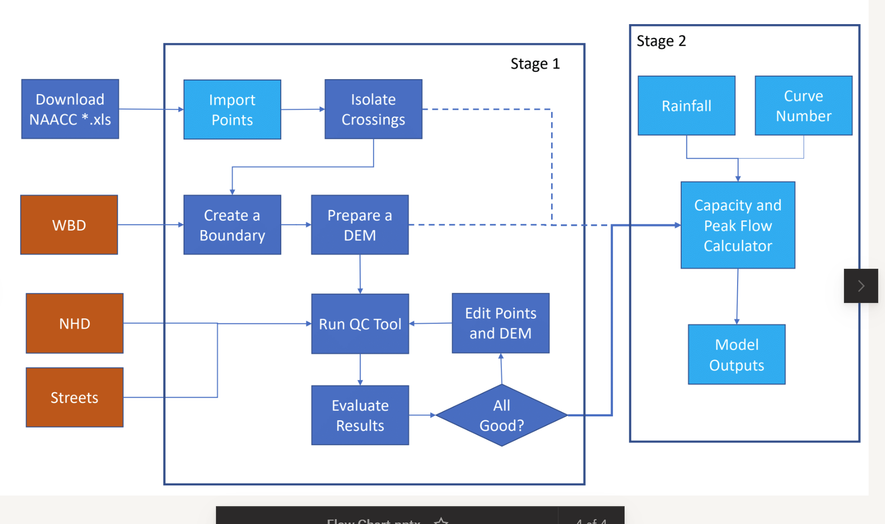

# Overview

The calculators provided by the Culvert Toolkit rely on specific spatial datasets to derive location-specific parameters that are then used as inputs to stormwater runoff and culvert capacity models.

---
## Types of Datasets Used as Inputs

The section describes what, where, and how to acquire the various inputs required to run the tool. 

Note that a number of these inputs require some basic competency in GIS to create, as they are not necessarily available off-the-shelf (depending on your area of interest).

### *NAACC culvert/crossing records*

The culvert/crossing records available from NAACC provide the starting point for the analysis.

See *[Working with NAACC Culvert Data](naacc-table.md)* for more information.

### *Digital Elevation Model (DEM)*

The DEM provides the data for determining what is upstream of a culvert/crossing, as well as some characteristics of that area that are important to calculating peak flow.

Sources for a DEM could be:

* Elevation raster
* Elevation TIN
* Elevation point clouds (i.e., from LiDAR)

From any of those sources, derive the following rasters for your area of interest.

* slope
* flow direction
* flow length (optional)

### *Curve Number*

The curve number represents the runoff potential of the contributing watershed above a culvert. It is derived from a combination of landcover and soil condition data.

Sources:

* Soils
* Landcover
* TR-55 Manual Table 2.1

Derive a single curve number raster for your area of interest

### *Rainfall*

See *[Getting NOAA Rainfall Data](noaa-rainfall.md)* for more information.

Sources: 

* NOAA rainfall rasters for your area of interest

#### Note:

(Re)Enable support NOAA precipation table in the future.

---

## Preparing Data

### Considerations for Preparing Data

You'll need to determine the the trade-off between speed and accuracy based on your use case:

* Ideal: full hydrologic correction of the DEM and re-locating of culverts with LIDAR and imagery
* Workable: fill sinks in DEM; burn hydro lines into the DEMs; snap culverts to available hydro steam lines; 

The best approach for determining DEM hydrologic-accuracy and NAACC location-correctedness depends on your use case.