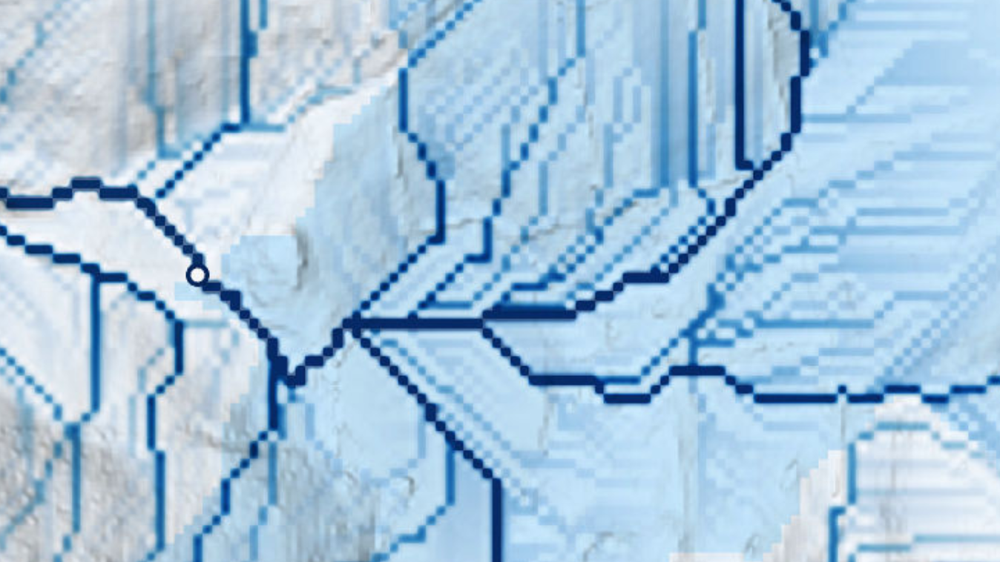

# Culvert Analysis Toolkit

***This documentation is a work-in-progress***

<!--  -->

The Culvert Analysis Toolkit is a collection of GIS tools designed to support analysis of culvert performance within their watershed. It uses a [TR-55 Model](https://www.nrcs.usda.gov/Internet/FSE_DOCUMENTS/stelprdb1044171.pdf) and parameters derived from geospatial data to calculate peak-flow and culvert capacity.

This software has been developed by [CivicMapper](https://www.civicmapper.com) in collaboration with [GroundPoint Engineering](https://groundpoint-engineering.com/), and encompasses work from a collaboration with the Cornell Soil & Water Lab (on GitHub @ [github.com/SoilWaterLab](https://github.com/SoilWaterLab)). See [Credits/Contributors](index.md#creditscontributors) for more information.

---

## Getting Started

1. [Installation](install.md): get the Culvert Analysis Toolkit set up in ArcGIS Pro
2. [Data Guides](data-overview.md): walk-throughs of the types inputs the tool requires and how to prepare them
3. [Analysis Guide](analysis-overview.md): an overview of the tools and what they do. using the tool and working with the results
4. Calculators: an explanation of the [peak-flow](calcs-peak-flow.md) and [capacity](calcs-culvert-capacity.md) calculators, with links to the underlying calculation code on GitHub

---

## Who is this toolkit for?

The toolkit is designed to support understanding the efficacy of stormwater culvert infrastructure at a broad scale for planning purposes. To that end, the tool has two audiences:

* Planners, who can use the outputs to support decision-making
* Analysts, who are able to run the tool in GIS software and are comforttable wrangling the spatial datasets that are required inputs of the tools

### What this toolkit is not

This toolkit is not:

* a replacement for engineering tools like HEC-RAS or SWMM
* appropriate for supporting the design and engineering of indivdual culverts

---

## Credits/Contributors

This software encompasses work originally developed by the Cornell Soil & Water Lab (on GitHub @ [github.com/SoilWaterLab](https://github.com/SoilWaterLab))

This repository represents an evolution of a previous effort, the [Peak-Flow Calculator](https://github.com/civicmapper/peak-flow-calculator/), which was a hard fork of the Water Lab's [CulvertEvalution](https://github.com/SoilWaterLab/CulvertEvaluation) repository. 

Made in collaboration with the Cornell S&W lab, this repository includes additional updates to the science of the from [CulvertModel_2.1](https://github.com/SoilWaterLab/CulvertModel_2.1).

* Original peak flow analytics are based on the culvert evaluation model developed by Rebecca Marjerison at the Cornell Soil and Water Lab in 2013, as [CulvertEvalution](https://github.com/SoilWaterLab/CulvertEvaluation)
* David Gold, python script development, August 4, 2015
* Object-oriented structure and resiliency updates built by Noah Warnke, August 31 2016 (no formulas changed).
* Updated by Zoya Kaufmann June 2016 - August 2017
* Merged with older versions by Tanvi Naidu June 19 2017
* Fork, refactor, and creation of CLI and ArcMap interfaces by Christian Gass @ CivicMapper, Fall 2017, as [peak-flow-calculator](https://github.com/civicmapper/peak-flow-calculator/)
* Updates for use within ArcGIS Pro by Christian Gass @ CivicMapper, Spring/Summer 2019, in [peak-flow-calculator](https://github.com/civicmapper/peak-flow-calculator/)
* [CulvertModel_2.1](https://github.com/SoilWaterLab/CulvertModel_2.1)by Jo Archibald in 2019
* Drain-It repository by CivicMapper, 2021-2022